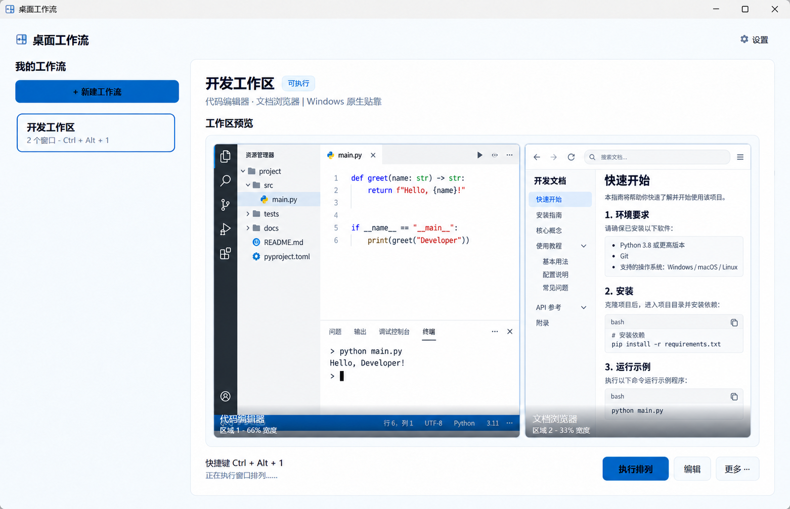
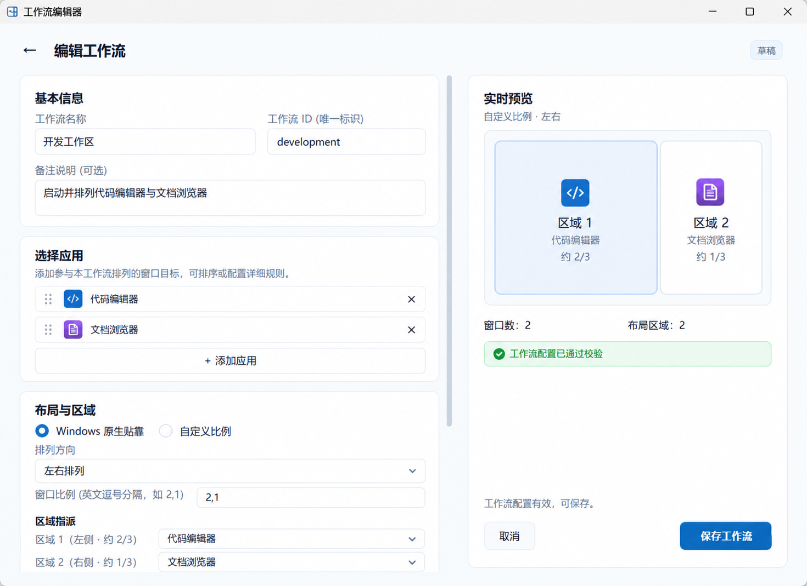

# DesktopWorkflow

English | [简体中文](README.md)

[](https://github.com/SANG4242/WindowsDesktopWorkflow/actions/workflows/build.yml)
[](LICENSE)
[](https://www.microsoft.com/windows)
[](https://dotnet.microsoft.com/download/dotnet/10.0)

DesktopWorkflow is an open-source Windows workspace launcher and window layout manager. It saves applications, window matching rules, layouts, and global hotkeys as reusable workflows. A workflow can launch or reuse multiple windows and arrange them from the control window, system tray, or a keyboard shortcut.

It is designed for recurring development, study, writing, operations, and data-analysis workspaces. The application is built with C#, .NET 10, and WPF. It runs locally by default and requires no account or cloud service.

## Screenshots





> Applications, files, and pages shown in the screenshots are generic demonstration content and contain no real user data.

## Features

- **Launch or reuse windows:** Find existing windows by process name, title, and optional command-line characteristics. Missing applications are launched and awaited.
- **Two layout strategies:**
  - Windows 11 native snapping uses six stable layout profiles, interacts with the system `Win + Z` UI, and verifies the resulting geometry.
  - Proportional layouts arrange any number of windows horizontally or vertically using ratios such as `2,1` or `1,1,1`.
- **Visual workflow editor:** Add targets from running windows, installed applications, or local `EXE` / `LNK` files; edit launch and matching rules; assign layout zones; preview changes immediately.
- **Workspace center:** View workflows, application counts, effective hotkeys, and live window thumbnails. Run, edit, duplicate, import, export, or delete a workflow.
- **System integration:** System tray controls, per-workflow global hotkeys, and optional launch at sign-in.
- **Recoverable execution:** Capture temporary window state before arranging. On failure or cancellation, attempt to restore the previous state. Native snapping failures are reported instead of silently falling back to ordinary window positioning.
- **Local declarative configuration:** Workflows are stored as UTF-8 INI files that are easy to inspect, back up, edit, and version.
- **Multi-monitor and DPI support:** Target the primary display, the display under the pointer, or a numbered display. Native layout mappings are stored per display environment.

## Download and run

Download an artifact from [Releases](https://github.com/SANG4242/WindowsDesktopWorkflow/releases):

| Artifact | File name | Description |
| --- | --- | --- |
| Installer | `DesktopWorkflow-Setup-v<VERSION>-x64.exe` | Per-user English setup with optional desktop shortcut and launch at sign-in |
| Portable ZIP | `DesktopWorkflow-v<VERSION>-Portable-x64.zip` | Extract and run `DesktopWorkflow.exe`; includes examples, license, and documentation |
| Single-file executable | `DesktopWorkflow-v<VERSION>-SingleFile-x64.exe` | Self-contained standalone executable |
| SHA-256 checksums | `DesktopWorkflow-v<VERSION>-SHA256SUMS.txt` | Verify downloaded artifacts |

All release artifacts target Windows x64 and are self-contained, so the .NET Runtime does not need to be installed separately. The installer uses a per-user location and does not require administrator privileges by default.

Windows 11 22H2 or later is required for native Snap Groups. Windows 10 can use proportional layouts.

### Update and uninstall

All three distribution formats share workflows, settings, and logs under `%LOCALAPPDATA%\DesktopWorkflow`. Updating the program does not remove this user data.

- **Installer:** Exit DesktopWorkflow and run the new installer over the existing installation. The uninstaller can preserve user data, allowing a later installation to reuse existing workflows.
- **Portable ZIP:** Exit from the tray, remove the old program directory, and extract the new ZIP to a fresh directory. Do not overwrite `DesktopWorkflow.exe` while it is running.
- **Single-file EXE:** Exit from the tray, replace the old executable, and start the new one.
- **Switch distribution formats:** Exit the old copy and start another format. It reads the same user data directory. Avoid running multiple copies at the same time.
- **Remove everything:** After deleting the portable files or running the uninstaller, manually delete `%LOCALAPPDATA%\DesktopWorkflow`. This removes workflows, settings, and logs, so export anything you want to keep first.

### Create your first workflow

1. Start the application and select **New workflow**.
2. Enter a name and add applications from **Current windows**, **Installed applications**, or **Choose file**.
3. Select native Windows snapping or a proportional layout, then assign applications to zones.
4. Optionally assign a global hotkey and save the workflow.
5. Run it from the main window, system tray, or hotkey.

[`examples/记事本单窗口.ini`](examples/记事本单窗口.ini) is a ready-to-import Notepad example.

## Workflow configuration

Default user data location:

```text
%LOCALAPPDATA%\DesktopWorkflow\
├─ workflows\                 # UTF-8 INI workflows
├─ settings\
│  ├─ user-settings.ini       # Local preferences and hotkey overrides
│  ├─ native-layout-profiles.json
│  └─ active-session.json     # Recovery snapshot, present only while arranging
└─ logs\
   └─ desktop-workflow.log
```

Use `--workspace-root <directory>` to select another data root for portable testing or development.

Minimal example:

```ini
[workflow]
id=notepad-example
name=Notepad example
description=Single-window proportional layout
hotkey=

[window.1]
name=Notepad
exe=C:\Windows\System32\notepad.exe
args=
workdir=C:\Windows\System32
match=Notepad ahk_exe Notepad.exe
process_args_contains=
reuse=true
wait_seconds=20

[layout]
mode=proportional
orientation=horizontal
ratios=1
gap=0
monitor=primary
native_profile=wide-left
native_layout=5
native_zones=1
native_delay_ms=700
```

Configuration rules:

- `workflow.id` must be unique across all workflows.
- `window.N` sections use consecutive numbering starting at 1.
- `match` can contain multiple title candidates and an `ahk_exe` process name.
- `process_args_contains` can distinguish multiple profiles or instances of the same application.
- The number of `ratios` must match the number of windows; ratios are normalized automatically.
- `monitor` accepts `primary`, `mouse`, or a one-based display number.

An exported workflow may contain local executable paths, launch arguments, window titles, or browser profile names. Review the INI file before sharing it publicly.

## Design

### Describe target state, not persistent window handles

A workflow describes which windows are needed and how they should be arranged. Windows are discovered or launched again for every run. Volatile window handles are not stored, and the application stops managing windows after a successful arrangement.

### Separate window preparation from layout execution

Execution is divided into discovery, concurrent launch and wait, state capture, layout application, geometry verification, and commit or rollback. Launch rules remain independent of layout strategies, which keeps new discovery sources and layout implementations isolated.

### Keep native snapping and proportional positioning explicit

Ordinary Win32 positioning can set window rectangles but cannot create a native Windows Snap Group. DesktopWorkflow implements the modes separately: native mode drives the system Snap Layouts UI and verifies the result, while proportional mode calculates display work-area rectangles directly. A failed mode is never reported as success through another mode.

### Make configuration and execution recoverable

Workflow saves use a temporary file, parse validation, replacement, and compensation steps. Window arrangement writes a short-lived session snapshot before moving windows. The snapshot is deleted after success and used for best-effort restoration after failure, cancellation, or an interrupted previous run.

### Local-first operation

The core execution path contains no telemetry, analytics, or network upload. Workflows, display mappings, and logs remain in the user's local data directory. Logs can contain window titles, executable paths, and launch arguments needed for troubleshooting, so they should be reviewed before sharing.

## Architecture

```text
src/DesktopWorkflow.App/
├─ App.xaml(.cs)                    # Lifecycle, tray, hotkeys, single instance, composition
├─ MainWindow.xaml(.cs)             # Workspace center
├─ WorkflowEditorWindow.xaml(.cs)   # Single-page, two-column workflow editor
├─ ApplicationDiscoveryServices.cs  # Running windows, installed apps, shortcut discovery
├─ IniServices.cs                   # INI parsing, validation, and user settings
├─ WorkflowFileStore.cs             # Compensating save, import, and delete operations
├─ WorkflowRunner.cs                # Window preparation and execution pipeline
├─ WindowMatcher.cs                 # Window and process matching
├─ WindowLayoutService.cs           # Native snapping and proportional positioning
├─ WindowSessionManager.cs          # Temporary snapshots and failure recovery
└─ NativeLayoutProfiles.cs          # Native layout mappings per display environment
```

Main execution pipeline:

```text
Workflow entry point
  → load and validate configuration
  → find or launch all target windows
  → capture window state
  → apply native or proportional layout
  → verify the result
  → commit and remove snapshot / restore on failure
```

## Development

### Requirements

- Windows 10/11 x64
- .NET 10 SDK
- Optional: Inno Setup 6 for the installer
- PowerShell 7 for repository scripts

### Build and run tests

```powershell
git clone https://github.com/SANG4242/WindowsDesktopWorkflow.git
cd WindowsDesktopWorkflow

dotnet build src/DesktopWorkflow.App/DesktopWorkflow.App.csproj -c Release
dotnet run --project src/DesktopWorkflow.Tests/DesktopWorkflow.Tests.csproj -c Release
```

`DesktopWorkflow.Tests` is a console test runner without a third-party test framework. It currently covers configuration round trips, proportional zones, the native layout catalog and constraints, and multiple targets generated from the same application.

### Local publish, verification, and packaging

```powershell
# Create the framework-dependent app/ directory used for local execution
./scripts/发布.ps1

# Verify Release build, tests, workflow parsing, and the complete app/ file hashes
./scripts/验证.ps1

# Build the portable ZIP, single-file executable, and installer
./scripts/打包.ps1 -Version 1.0.0
```

Exit the repository's running DesktopWorkflow tray instance before running `发布.ps1`. A full package build requires Inno Setup 6. Without it, run `./scripts/打包.ps1 -Version 1.0.0 -OutputTypes portable,singlefile` to build only the portable ZIP and single-file executable. GitHub Actions can build the installer for a version tag.

### GitHub Actions releases

CI builds and packages pushes to `main`, `master`, and pull requests. A tag such as `v1.0.0` creates a GitHub Release and uploads EXE and ZIP files from `dist/`:

```powershell
git tag v1.0.0
git push origin v1.0.0
```

Before a public release, test the following on a visible desktop:

- all three application sources: running windows, installed applications, and `EXE` / `LNK` files;
- native Snap Groups and failure restoration;
- proportional layouts, multiple displays, and DPI scaling;
- hotkey conflicts, tray execution, and launch at sign-in;
- import, export, overwrite, duplicate, and delete flows;
- install, upgrade, uninstall, and user-data retention.

## Extension guidelines

When adding capabilities, preserve the current boundaries:

- A new discovery source should produce the shared window-target model.
- A new layout strategy should remain an isolated service and retain verification and rollback.
- Configuration changes should update parsing, serialization, validation, and round-trip tests together.
- Tests that move real windows should stay separate from headless automation.
- User-file deletion should continue to use the Recycle Bin and compensation on failure.

Reproducible bug reports and focused pull requests are welcome. Include the Windows version, display layout, DPI, sanitized workflow configuration, reproduction steps, and a minimal relevant log excerpt.

## Known limitations

- Windows provides no stable public API for creating Snap Groups directly. Native mode depends on the `Win + Z` system UI, whose menu order can vary by Windows build, language, and display environment.
- Native snapping requires foreground interaction. Remote desktops, virtual displays, or focus contention can cause verification to fail.
- Window title and command-line matching rules depend on target applications and may require updates after those applications change.
- Proportional layouts do not create native Windows Snap Groups.
- Automated tests do not replace visible-desktop testing for native snapping, installers, or multi-monitor behavior.

## Privacy and security

- The application does not include telemetry or an account system and does not access the network by default.
- Workflows, settings, session snapshots, and logs are stored under `%LOCALAPPDATA%\DesktopWorkflow`.
- Logs may contain window titles, executable paths, and launch arguments. A session snapshot may temporarily contain window and process information.
- Imported workflows can launch the programs they specify. Import only trusted configurations and inspect `exe`, `args`, and `workdir` first.

Before publishing a diagnostic log, remove personal paths, document titles, and sensitive launch arguments.

## License

Licensed under the [MIT License](LICENSE).
